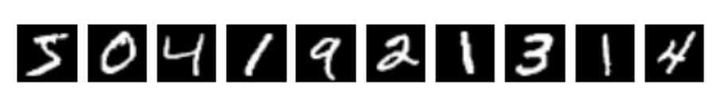

# AI-coursework
COMPSCI4004 Artificial Intelligence H - Coursework

## Problem Statement

We will explore an approach to select an optimal set of training instances for supervised learning. Specifically, we are going to work with the MNIST [$^1$](#references) dataset, a popular dataset for hand-written digit recognition. Some examples of the images in the MNIST dataset are illustrated in Figure 1.



Figure 1: Examples of the images in the MNIST dataset.

Classifying the images in MNIST is no longer a big challenge since a lot of advanced deep learning models have been proposed over the years and the top performers can achieve a classification accuracy of over 99% (see [Image Classification on MNIST](https://paperswithcode.com/sota/image-classification-on-mnist)). 

Having said that, most of the existing methods are based on the assumption that the annotation
of the data is reliable and train the model accordingly. However, it is possible that the dataset
contains inaccurate annotation due to human mistakes or even contaminated data. As a result, the
performance of the trained model will be degraded.

We implemented a simulated workflow of learning with corrupted labels [$^1$](#references), which will act as a starting point for implementing your own solutions.

The notebook provides functions to corrupt labels with **common types of mistakes** (specific to this hand-written digit classification task), such as labelling a “3” as a “8” (and vice versa), a “1” as a “4” or “7” etc. A parameter that controls how many annotations will be corrupted in the dataset (i.e., how noisy is the data) by specifying a value for noise probability ($\isin [0, 1]$).

Some utility functions to start the supervised (parametric) training with the (noisy) labelled examples using `trainAndEvaluateModel()` are provided.

Points to note:
1. We are not going to change the model architecture. This is considered frozen.
2. We are going to investigate if changing the dataset (seeking to leave out the noise from the training set) improves the accuracy over the test set.

You don’t need to understand how the classification model really works (it’s a one-layer 2D convolution network, which is covered in the Deep Learning and Computer Vision courses). The model’s reference implementation is to be used only to evaluate the quality of your training data (the better the trained model performs on the test set, the better is the quality of the training set).

## Tasks

You need to implement a **subset selection function** that when called will return a subset of instances which will be used to train the model.

> Hypothesis: A model trained on noisy labels may not be that good. Whereas, if we can filter out the noisy data then perhaps we can improve on the test set accuracy, i.e., lead to more robust training.

To make your task easier, the workflow lets you also pass in a dictionary which contains the indexes of the instances that you would not want to use while training the model, i.e., it should contain a list of indexes that you would decide to **leave out** for training. THIS DECISION COMES FROM THE IMPLEMENTATION METHOD CHOSEN.

A very simple and naive approach in the baseLinePrunedSubsetMethod is already implemented. This method randomly selects a subset of samples to be pruned during the training (so, this essentially is a one-step random agent).

To test the oracle (ideal) situation, the program (during generating the corrupted data as a part of the simulation) keeps track of which data instances were corrupted. It turns out that if you indeed leave out those ones, you get a considerable improvement in the accuracy. This is achieved via the following line:

```python
trainAndEvaluateModel(x_train, y_train_onehot,
    x_test, y_test_onehot, model, corrupted_indexes)
```

We **cannot** use this `corrupted_indexes` dictionary as this is an unrealistic assumption. This simply gives a sort of an upper bound on the performance we expect. We expect results to be somewhere between the random baseline and the oracle.

In summary, we should implement `myPrunedSubsetMethod(x_train, y_train, model)`. The function should return a dictionary of indexes that are to be left out. You can then plug your function in and evaluate the results.


### Hints

We can approach this as a "discrete state space optimisation" problem, where firstly we can define a “selection batch size” which decides which batch of instances we’re going to leave out (this is not the same as training batch size). For instance, if we are in a state where the training set is $X$, we may select (by some heuristics) which points we’re gonna leave out (let that set be $\delta_1 \sub X$) so that a child state becomes $X' = X − \delta$.

Similarly, if we choose a different $\delta' \sub X$, we reach a different child state. We then need to train and evaluate to see if that child state led to an improvement or not.

A larger batch size (number of data point we will leave out) would mean that we have a smaller number of children states to consider.

### Steps

1. Defining the states and actions:
   - Clearly define the states and the actions for this problem. Clearly describe with a diagram the transition between two pairs of states.
2. Explain the design of your solution
   - This is the core of the methodology. Based on the states and actions explained in the previous section, we will focus on the method and algorithm to guide your subset selection program from the initial state to the goal state.
   - Explain the rationale behind the design and justify your decisions. Discuss the other alternative solutions as well. In-line references can be included to further support arguments.
3. Reporting the classification results
   - Use a table to summarize the classification results on the baseline(s) and solution(s).


## Notes

1. `np.expand_dims(array, axis)` expands the shape of an array. 
   1. For example, if `array.shape = (3, 4)`, then `np.expand_dims(array, axis=-1).shape = (3, 4, 1)` (adds another dimension in the last position). If `axis=0`, then `np.expand_dims(array, axis=1).shape = (1, 3, 4)`. 
   2. E.g. `[[1, 2, 3], [4, 5, 6], [7, 8, 9]]` $\rArr$ `[[[1], [2], [3]], [[4], [5], [6]], [[7], [8], [9]]]`
2. `random.random()` generates a random float number in the range [0.0, 1.0).
3. Boundaries [~87%, 97.66%] 


## References

<!-- [$^1$](#references) -->

[1] https://colab.research.google.com/drive/1pWnuZ4AVZOkh2ZTTp-xtVnnoiTrXCwr6?usp=sharing


## possibilities

1. train model on all data set then remove some randomely then evaluate then assign a weight to each data point based on the accuracy of the model on the test set. Then remove the data points with the lowest weight and retrain the model and evaluate again. Repeat this process until the accuracy of the model on the test set stops improving. This is a greedy approach.
2. train model on all data set then assign weight to all data points
   1. then remove some randomly chosen data pint then reevaluate then update the weight based on the accuracy from the test set. 
   2. then remove other randomly chosen data point then reevaluate then update the weight based on the accuracy from the test set.
   3. repeat for n times.
   4. then remove the data points with the lowest weight and retrain the model and evaluate again. 
   5. data points with the lowest weight are the ones that are most likely to be mislabelled.
3. 