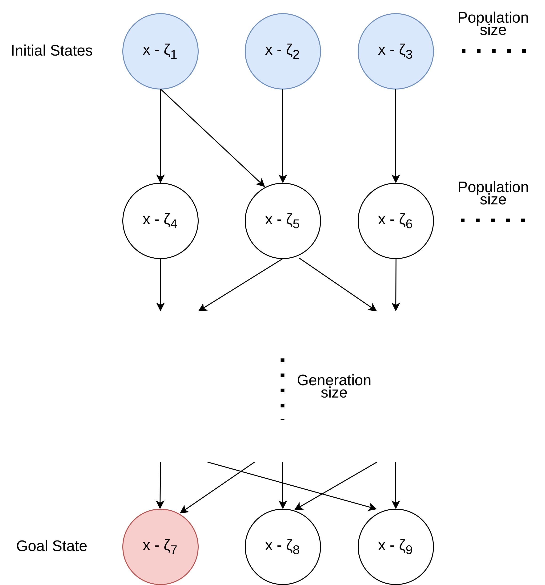
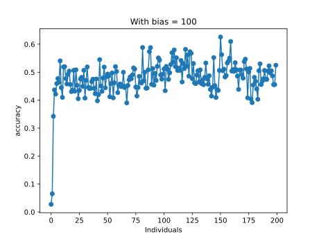
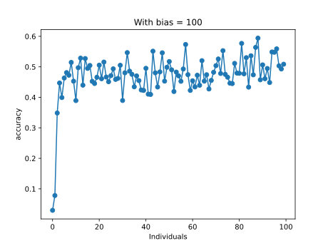
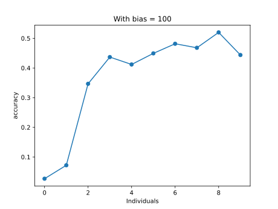
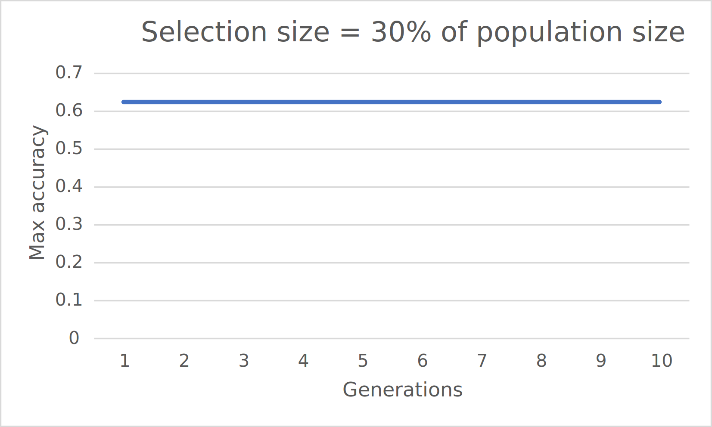
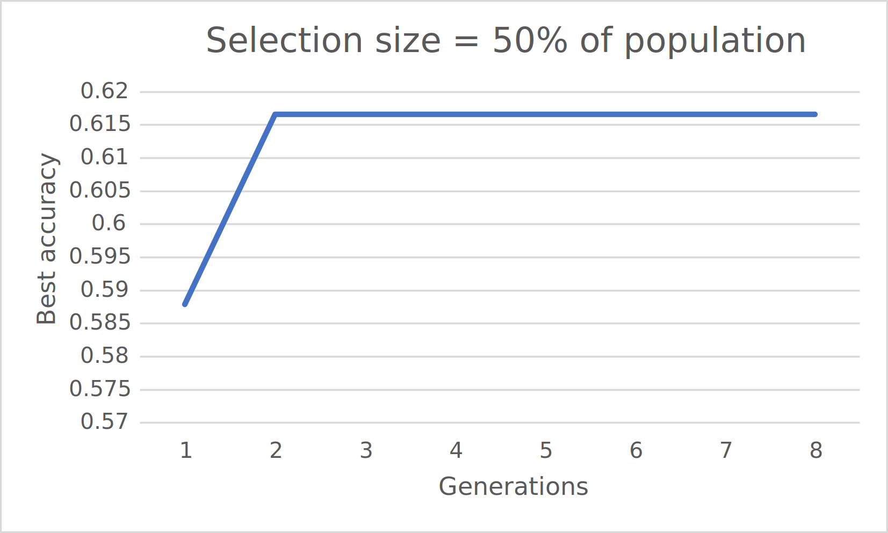
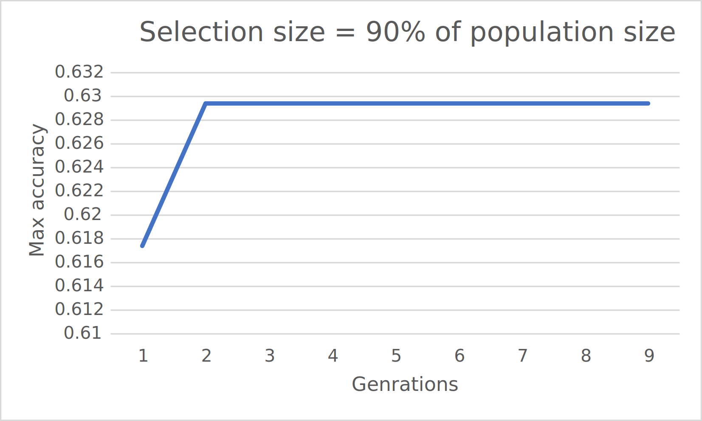
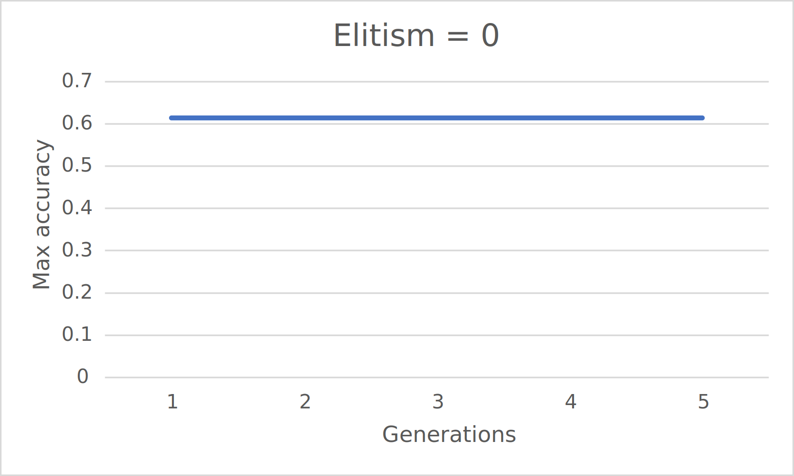
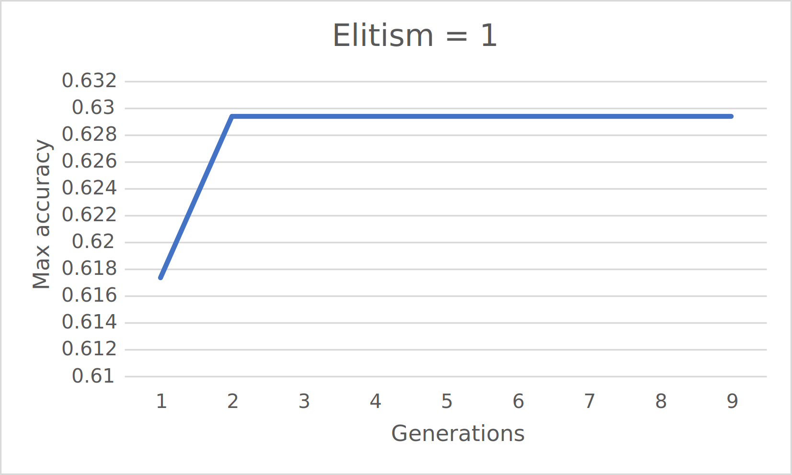
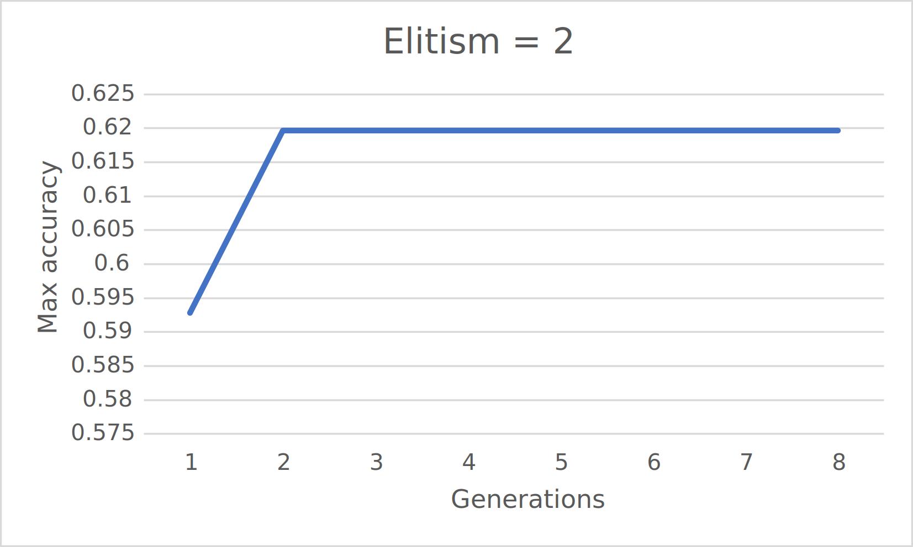

# AI-coursework - Genetic Algorithm

COMPSCI4004 Artificial Intelligence H - Coursework

## Problem Statement

We will explore an approach to select an optimal set of training instances for supervised learning. Specifically, we are going to work with the MNIST [1](#references) dataset, a popular dataset for hand-written digit recognition. Some examples of the images in the MNIST dataset are illustrated in Figure 1.


Figure 1: Examples of the images in the MNIST dataset.

Classifying the images in MNIST is no longer a big challenge since a lot of advanced deep learning models have been proposed over the years and the top performers can achieve a classification accuracy of over 99% (see [Image Classification on MNIST](https://paperswithcode.com/sota/image-classification-on-mnist)).

Having said that, most of the existing methods are based on the assumption that the annotation
of the data is reliable and train the model accordingly. However, it is possible that the dataset
contains inaccurate annotation due to human mistakes or even contaminated data. As a result, the
performance of the trained model will be degraded.

We implemented a simulated workflow of learning with corrupted labels [1](#references), which will act as a starting point for implementing your own solutions.

The notebook provides functions to corrupt labels with **common types of mistakes** (specific to this hand-written digit classification task), such as labelling a “3” as a “8” (and vice versa), a “1” as a “4” or “7” etc. A parameter that controls how many annotations will be corrupted in the dataset (i.e., how noisy is the data) by specifying a value for noise probability ($∈ [0, 1]$).

Some utility functions to start the supervised (parametric) training with the (noisy) labelled examples using `trainAndEvaluateModel()` are provided.

Points to note:

1. We are not going to change the model architecture. This is considered frozen.
2. We are going to investigate if changing the dataset (seeking to leave out the noise from the training set) improves the accuracy over the test set.

You don’t need to understand how the classification model really works (it’s a one-layer 2D convolution network, which is covered in the Deep Learning and Computer Vision courses). The model’s reference implementation is to be used only to evaluate the quality of your training data (the better the trained model performs on the test set, the better is the quality of the training set).

# Introduction

This report discusses using a Genetic Algorithm (GA) to improve the
model performance on the MNIST dataset using a supervised approach. The
problem at hand involves dealing with potentially corrupted data within
the dataset, impacting the performance of trained models. The
methodology embraces a unique approach, tailoring the initial population
of the GA by considering the class frequency differences within the
corrupted MNIST dataset. This strategic bias towards underrepresented
classes aims to enhance classification accuracy. The report outlines the
steps involved in the algorithm, from initialising the population to
transitioning to subsequent generations, incorporating key processes
such as selection, crossover, and mutation. The focus is ensuring a
diverse and efficient search through the solution space, balancing
computational resources with the potential for reaching optimal or
near-optimal solutions.

# State and Action Definition in Genetic Algorithm

## States

I chose to use the Genetic Algorithm to find the best possible state
(**goal state**). As shown in Figure
[1](#fig:state_diagram), we start with multiple **initial
states** (in terms of the GA algorithm, they are called individuals in
the population). The initial states are started almost randomly but not
quite. Further details about this are discussed later in Section
[3](#Algorithm-Design-and-Implementation).
These initial states create the first population in the generation.



## Actions

The following actions create the subsequent generations: **Selections,
Crossover and Mutation.**

Figure [1](#fig:state_diagram) shows the transition between the states.
This is done by selecting $N$ best states from the current generation to
progress to the next generation (the subsequent states). Then, to
re-construct the population, new states are created by performing
crossover and mutating the *selected* states.

# Algorithm Design and Implementation

My solution exploits the fact that the MNIST data set has roughly an
equal number of data points for each digit class. Therefore, after
corruption, the difference in frequency of the digits will only get
bigger. This is shown in Table
[1](#tab:digit_frequency)

| Digit | Before | After | Difference |
| ----- | ------ | ----- | ---------- |
| 0     | 5923   | 6003  | 80         |
| 1     | 6742   | 6561  | -181       |
| 2     | 5958   | 5906  | -52        |
| 3     | 6131   | 6073  | -58        |
| 4     | 5842   | 6339  | 497        |
| 5     | 5421   | 5782  | 361        |
| 6     | 5918   | 5624  | -294       |
| 7     | 6265   | 5949  | -316       |
| 8     | 5851   | 5900  | 49         |
| 9     | 5949   | 5863  | -86        |

*Table: Digit frequency in the MNIST data set*


In the following sections, I will explain my implementation of the
Genetic Algorithm.

## Initialising population

Population in the Genetic Algorithm is a collection of individuals in a
generation. Individuals are the states representing ($X-\delta$), and
they are simply an array of 0's and 1's; where a \"1\" means \"prune
this index\". The number of generations is how many iterations of
actions we perform on the population. More generations ensure the
maximum (local or global) is achieved. In contrast, a bigger population
ensures diversity and a higher potential to find the global maximum.

By using the knowledge from Table
[1](#tab:digit_frequency), we can estimate the noise difference
and, then, bias toward the underrepresented classes for better
classifications. This calculations are done when creating the initial
population (states) and is demonstrated in the following section of the
code:

``` 
def create_population(population_size, input_size, y_train, bias_strength=100):
    
    ...
    
    classes, freq = np.unique(y_train, return_counts=True)
    class_frequencies = 
    max_freq = max(class_frequencies.values())
    
    prioritisation_scores = 

    for _ in range(POPULATION_SIZE):
        individual = np.ones(INPUT_SIZE, dtype=int)
        ...
        if random.random() < ((prioritization_scores[class_label] / max_freq)*bias_strength):
                individual[i] = 0

    ...

    population = [tuple(individual) for individual in population]

    return population
```

The \"Prioritisation scores\" is a dictionary of the weights of every
digit in the data set. It looks like this:

$\{0: 1.09, 1: 1.0, 2: 1.11, 3: 1.08, 4: 1.04, 5: 1.13, 6: 1.17, 7: 1.1, 8: 1.11, 9: 1.12\}$

Where the keys are the digit classes and the values are their weights
(frequency relative to other classes).

Then we normalised it by dividing this value by the $max\_freq$ and
multiplying the result by a $bias\_strength$; This gives us a value
between 0 and 1, which we can use to decide how biased we want to be
toward the underrepresented classes. The $bias\_strength$ value defines
the strength of how much we should bias the results toward the
underrepresented classes. The entire initial population is created this
way.

When creating the population, we also don't allow duplicates (identical
individuals). This will enable us to prevent processing identical
individuals twice and improve the diversity in our initial states. In
addition, we start with individuals, primarily 1s (i.e., prune most
indexes). This makes the initial computations faster and allows us to
perform more generations.

Afterwards, we evaluate the \"fitness\" of each individual by calling
the $evaluate\_fitness()$ function, which calculates the indexes to
prune using the individual's array and calls $trainAndEvaluateModel()$
to find its accuracy. The indexes to prune are the index where this
individual has the value 1 in its array.

I used caching to ensure fast training time with the
$evaluate\_fitness()$ function. This is because evaluating a state's
fitness (accuracy) is very slow, and as I explain in Section
[3.2.1](#selection_step), some individuals will be carried over to
the next generation without modification. It would be a waste of time
and resources to re-evaluate their fitness at every generation.

``` 
from functools import lru_cache

@lru_cache(maxsize=None)
def evaluate_fitness(model, individual):
    ...
    return accuracy
```

## Transition to next generation

After this, for every generation, the $create\_next\_generation()$
function performs **selection, crossover, and mutation** on the current
population and returns a new list of populations.

### Selection 

In the selection step, we select $selection\_size$ number of individuals
to stay to the next generation. The $selection\_size$ is less than the
$population\_size$ (e.g. 1/2 $population\_size$) because if not, the
same population will remain until the next generations, and no
improvements (crossover or mutation) will be performed. The selected
individuals are the best in their populations (regarding accuracy). The
selection step breaks down into two steps: **Elitism and Selection**.
Elitism is discussed in Section
[3.2.2](#elitism_step).
The selection approach I chose is a **tournament selection** where
$battle\_participants$ (e.g. 4 participants) individuals are selected
randomly from the population and fight each other. The one with the best
accuracy will stay until the next generation.

This is demonstrated in the following section of the code:

``` 
def select_individuals(population, fitness_scores, selection_size, battle_participants, elite_num):
    ...
    
    while len(selected_individuals) < selection_size:
        participants = random.sample(list(zip(population, fitness_scores)), battle_participants)
                                    
        sorted_participants = sorted(participants, key=lambda x:x[1], reverse=True)
        # append individual only, not fitness score:
        selected_individuals.append(sorted_participants[0][0])
    return selected_individuals
```

### Elitism 

Elitism is performed before tournament selection to ensure that
$elite\_num$ (e.g. 1) individuals are kept for the next generation. This
ensures that the best individuals are not discarded due to the random
selection in the tournament.

This is shown in the following code:

``` 
def find_top_N_elements(population, fitness_scores, N):
    ...
    for _ in range(N):
        max_index = np.argmax(fitness_scores)
        top_N.append(population[max_index])
        fitness_scores[max_index] = -1
    return top_N

def select_individuals(population, fitness_scores, selection_size, battle_participants, elite_num):

    ...
    selected_individuals.extend(find_top_N_elements(population, fitness_scores, elite_num))
    ...
    return selected_individuals
```

### Crossover

After selecting $selection\_size$ individuals to carry over to the next
generation, we need to re-create the population to keep it at the
$population\_size$. This is done by performing crossover and mutation on
the selected individuals.

To do the crossover, we select two random individuals from the selected
individuals list and swap over $crossover\_points$ (e.g. 3) sections
from the first individual to the other and vice versa. This only happens
$crossover\_rate$ (e.g. 0.3 or 30%) of the time. Otherwise, the same
individuals are added back to the selected population. This step and the
mutation step are repeated until there are $population\_size$
individuals again in the new generation.

``` 
def crossover(individual_1, individual_2, crossover_rate, crossover_points):

    if random.random() < crossover_rate:
        crossover_points = random.sample(range(1, len(individual_1)), crossover_points)
        crossover_points.sort()
        new_individual_1 = individual_1[:crossover_points[0]] + individual_2[crossover_points[0]:crossover_points[1]] + individual_1[crossover_points[1]:]
        new_individual_2 = individual_2[:crossover_points[0]] + individual_1[crossover_points[0]:crossover_points[1]] + individual_2[crossover_points[1]:]
        return new_individual_1, new_individual_2
        
    else:
        return individual_1, individual_2
```

### Mutation

The mutation step is done on every new individual after the crossover
step. In the mutation step, we iterate over all the bits (called genes
in terms of GA) and flip that bit (mutate) $mutation\_rate$ (e.g. 0.01
or 1%) of the time.

``` 
def mutate(individual, mutation_rate):

    new_individual = []
    for gene in individual:
        if random.random() < mutation_rate:
            new_individual.append(1 - gene) # flip the gene
            
        else:
            new_individual.append(gene)
    return new_individual
```

After mutation, the accuracy (fitness) is re-evaluated on the new
generation, and then we transition to the next generation by repeating
the \"selection\" step. When the new population returned is exactly the
same as the old population, this means that the algorithm has found the
maximum value. This value is likely not optimal (global maximum) but
rather a local maximum. Further analysis about the performance is done
in Section [5](#GA_analysis).

The maximum accuracy after every generation is written to a \"GA_0.csv\"
file to enable us to compare different hyperparameters and their effect
on the algorithm performance.

# Solution Evaluation and Results

The Genetic Algorithm is non-deterministic. This means that the results
vary a bit at every run because of its random nature in the selection,
crossover and mutation steps. That said, my solution achieved an
accuracy of over 60% on some runsand more than 55% most of the time,
which is above the baseline solution where indexes are pruned randomly,
achieving an accuracy of about 49%.

# Analysis of Genetic Algorithm Performance 

The hyperparameters I used are listed in Table
[2](#tab:hyperparameters) alongside the values I chose for each.
| Parameter           | Value | Description                                                         |
| ------------------- | ----- | ------------------------------------------------------------------- |
| Bias Strength       | 100   | Bias strength                                                       |
| Population Size     | 200   | Number of individuals in population                                 |
| Selection Size      | 160   | Number of individuals to select for next generation                 |
| Mutation Rate       | 0.1   | Probability of mutating each individual                             |
| Crossover Rate      | 0.5   | Probability of crossing over two individuals                        |
| Crossover Points    | 3     | Number of crossover points                                          |
| Generations         | 100   | Number of generations                                               |
| Battle Participants | 4     | Number of individuals to participate in a tournament                |
| Elite Number        | 1     | Number of elite individuals to keep from one generation to the next |

*Table: Digit frequency in the MNIST data set*


I will explain why I chose each of these values.

## Bias Strength

Bias strength is a multiplier to define how biased we should be toward
the underrepresented classes in the dataset. It mainly affects the
initial population because it is used only when creating the first
generation (initial states). I tested a range of values from 1 to 1000,
and my results are shown in Figure
[2](#fig:bias_strength).


As shown in the plot, with a bias strength of 100, it is possible to get
individuals in the initial population with accuracy level just below
60%. This means that the initial population already performs well. This
helps us determine the maximum accuracy faster after generations as we
don't start with random individuals but rather with individuals that
already perform better than random.

## Population size

As I mentioned, a bigger population means a higher diversity of
solutions in the generation. However, this comes at a computational time
cost. In Figure [6](#fig:population_size), I compared having the initial
population sizes at 200, 100 and 10 and found that, more than 200
individuals, the computational time to calculate their accuracy
(fitness) was getting much longer with a little accuracy improvement.

<figure id="fig:population_size">
<figure id="fig1:sfig1">

<figcaption>Population = 200 finished in <span
class="math inline">≈</span>10 minutes with max accuracy <span
class="math inline">≈</span> 60%.</figcaption>
</figure>
<figure id="fig1:sfig2">

<figcaption>Population = 100 finished in <span
class="math inline">≈</span>5 minutes with max accuracy <span
class="math inline">≈</span> 55%.</figcaption>
</figure>
<figure id="fig1:sfig3">

<figcaption>Population = 10 finished in <span
class="math inline">≈</span>2 minutes with max accuracy <span
class="math inline">≈</span> 50%.</figcaption>
</figure>
<figcaption>Comparison between different population sizes.</figcaption>
</figure>

Therefore, around 200 was the best choice for the $population\_size$.

## Selection Size

A selection size is chosen to keep the best-performing individuals at
every generation. I tried selection sizes of 30%, 50% and 90% of
population size. Figure [10](#fig:selection_sizes) shows the difference between them.

<figure id="fig:selection_sizes">
<figure id="fig1:sfig1">

<figcaption aria-hidden="true"></figcaption>
</figure>
<figure id="fig1:sfig2">

<figcaption aria-hidden="true"></figcaption>
</figure>
<figure id="fig1:sfig3">

<figcaption aria-hidden="true"></figcaption>
</figure>
<figcaption>Comparison between balanced and normal class
weighting.</figcaption>
</figure>

As shown in the plots, a larger selection size led to better results
because most of the best candidates are maintained for later
generations, increasing the population's overall performance. It is
worth mentioning that a larger selection size means less computational
time due to the decreased number of points that need to crossover or
mutate. In addition, all choices of selection sizes lead to convergence
at around generation 10, but the real difference appears in the
computational time required to perform each of them. With 90% selection
size, it took only 5 mins, while it took about 13 mins for 30% selection
size and 10 mins for 50% selection size. The accuracy is also slightly
better with higher selection size values as we can see about 1 to 2%
improvement.

## Crossover Rate, Crossover Points and Battle Participants

Crossover rate, crossover points and battle participants were selected
by trial and error. Crossover points decide how many sections from one
individual we should swap with another (e.g. 1 means one section, which
means half of the individual). This ensures that a variety of solutions
can be achieved, aiming to escape the local maximum. However, like
everything else, more points require more computational time. I chose
the values in Table [3](#tab:crossover_values), which gave me the best $\approx$ 60%
accuracy results.

The crossover step happens $crossover\_rate$ (e.g. 0.5 or 50%) of the
time. This helps reduce the computational time as well as control how
much variety we want after every generation.

The $battle\_participants$ are used with the selection stage to decide
how many participants we should have for the tournament selection. This
also controls how variant the new individuals will be in the future
generations.

| Parameter           | Value |
| ------------------- | ----- |
| Crossover Rate      | 0.5   |
| Crossover Points    | 3     |
| Battle Participants | 4     |

*Table: Crossover values*


## Mutation rate

Mutation helps us escape a local maximum by discovering random variation
of an individual (by mutating one or more of their genes), which might
lead to the global maximum. This was also decided by trial and error,
and I found that a relatively high value of 0.1 or 10% leads to better
results compared to low values such as 0.01 or 0.05 (1 or 5%). So I
chose to use 0.1.

## Generations

In my solution, the population always converged before the 20th
generation. I chose 100 generations as the top limit but never reached
that limit. Further analysis of why this is the case is in Section
[6](#GA_improvements).

## Elite Number

Elitism guarantees that the best of the best individuals are kept for
future generations and are not affected by the random nature of the
tournament selection, crossover, or mutation. As shown in Figure
[14](#fig:elitism_values), I tried with values 0, 1 and 2.
However, an elite value bigger than 2 doesn't make sense, as it will
make the population converge much quicker.

<figure id="fig:elitism_values">
<figure id="fig1:sfig1">

<figcaption aria-hidden="true"></figcaption>
</figure>
<figure id="fig1:sfig2">

<figcaption aria-hidden="true"></figcaption>
</figure>
<figure id="fig1:sfig3">

<figcaption aria-hidden="true"></figcaption>
</figure>
<figcaption>Comparison between different elitism values.</figcaption>
</figure>

# Potential Improvements 

One of the problems my solution suffers from is an early convergence. My
solution usually converges just before generation 10 due to a local
maximum discovery. This prevents my solution from finding a better
accuracy value and, therefore, better classification performance. We
must implement more sophisticated crossover and mutation techniques to
avoid this. A possible solution for the crossover is by implementing a
**dynamic crossover**. Therefore, the crossover points and rate change
dynamically as generations progress. By that, I mean that we might
benefit from increasing the strength of crossover in the early
generations but then reduce it as generations pass.

Regarding the mutation, we can track which genes generally make the
accuracy better and force mutating them after a few generations to
improve the overall performance of a population.

Another possible way to solve the early convergence problem is by using
a hybrid approach. So, instead of solely depending on the Genetic
Algorithm, we can use another approach alongside it. E.g. using Hill
Climbing with Genetic Algorithm to search local branches and find the
optimal solution for each. This might yield better results.

# Conclusion

In this report, we presented a comprehensive exploration of using a
Genetic Algorithm to enhance the selection process of training instances
of the MNIST dataset in the presence of noisy data. The findings
demonstrate the approach's effectiveness, significantly improving
classification accuracy over a baseline model using random selection.
While the solution often converges to a local maximum, suggesting
limitations in exploring the entire solution space, the overall
performance indicates promising results can be achieved using the GA
algorithm. The potential improvements include dynamic crossover
techniques and focused mutation strategies.
